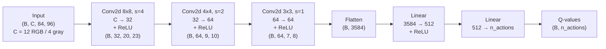
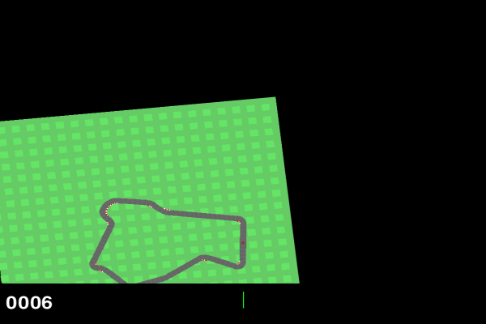

# Reinforcement Learning - Final Assignment

## Maybe it is better to train Race Cars with RGB colors?

Rutger de Groen - i6297772

## 1. Introduction

Carracing environments in AI were one of the first things that intrigued me about AI. "How the hell does this 2D car learn to drive this weird maze in several 100 generations?", i was baffled, did not understand this at all. Now 6 years later, following a course called Reinforcement Learning, I got the opportunity (Read: I was lazy for 6 years) to delve deeper into this matter. This final assignment implements a DQN algorithm to the carracing environment provided by Gymnasium (CITE) to teach a car drive a circuit.

## 2. Problem Statement or Research Statement

Ofcours I am not the first one trying to teach this car to drive. This environment is merely a toy example compared to what Tesla is doing with their cars. But anyways, I am here to learn about RL not about full driving autonomous cars in the real world. One of the first things I noticed about several implementation of DQN on the carracing environment from gymnasium, was the fact that all of them were trained after grayscaling the frames. I asked myself, "why not in rgb?". I guess the answer is quite trivial, the car does not neceserally have to learn colors to understand shapes and edges as long as there is some difference to the road and off-road parts. And secondly grayscale means learning less information, 1 channel instead of 3 color channels, so less computational complexity. But none of the online work (CITE) I found showed rgb results or talked about this difference fundamentally. So this final assignment I am going to figure out why people choose grayscaling over rgb, and if the "trivial" answer is so "trivial" after all!

To be a little bit more specific: "Is color really not that important for this type of game? and whatever the outcome is, why?"

## 3. Methodology

I used [PyTorch](https://pytorch.org/) for the DQN's and [Gymnasium](https://gymnasium.farama.org/) for the car racing environment. 

**The Network Architecture**  
The DQN network Architecture is as follows:



n_actions here is 5, since this setup is run in a discrete action space to support DQN. The actions a car can take are:

| Index | Action     |
|-------|------------|
| 0     | Do nothing |
| 1     | Steer left |
| 2     | Steer right|
| 3     | Gas        |
| 4     | Brake      |

**The Environment**  
The [car racing environment](https://gymnasium.farama.org/environments/box2d/car_racing/) is a simple 2D rgb game, a small demo is givin below:

<!-- markdownlint-disable MD033 -->

<!-- markdownlint-enable MD033 -->

My goal is to check the difference between RGB and grayscale, so I created 2 preprocessing functions to handle color of frames.

**RGB preprocessing:**

```python
def preprocess_without_graysscale(obs):
    # (96, 96, 3) uint8 -> (3, 84, 96) uint8, drops bottom indicator strip
    return obs[:84].transpose(2, 0, 1).copy()
```

**Grayscale Preprocessing:**

```python
def preprocess_grayscale(obs):
    # (96, 96, 3) uint8 -> (1, 84, 96) uint8, drops bottom indicator strip
    gray = 0.2989 * obs[:84, :, 0] + 0.5870 * obs[:84, :, 1] + 0.1140 * obs[:84, :, 2]
    return gray.astype(np.uint8)[np.newaxis]
```

**DQN and Double-DQN**  
On top of that I got inspired by this online repo by [witt](https://github.com/wiitt/DQN-Car-Racing), and also implemented Double-DQN. I know this does not really have to do any thing with measuring the difference between RGB and grayscale. But as I said in the beginning I am here to learn some cool things about RL, so why not throw some exploration in there! Double-DQN it is, so I tried this as well just to see what kind of effects it has on output results and mainly "why?".  

In short Double-DQN avoids overestimation. Since DQN only uses a single network to believe its own "hype", returns my be overestimating opposed to reality. Double-DQN uses two networks to create a believe about the return of a next action. The policy network says "Action A looks best!" and the target network will ask "Is action A really the best?". In case of overestimation, return will get corrected. Overestimation only exists when both networks are wrong which is a rarer occasion. So we should expect more stable return plots within the results section.  

The code snippets hereunder shows some of the innerworkings:  

The Data:

```python
def sample(self, batch_size, device):
    idxs = np.random.choice(self.size, batch_size, replace=False)
    ends = self.frame_ends[idxs]
    states = np.stack([self._stack(e, shift=1) for e in ends])
    next_states = np.stack([self._stack(e, shift=0) for e in ends])
    return (
        torch.tensor(states, dtype=torch.uint8, device=device).float() / 255.0,
        torch.tensor(self.actions[idxs],dtype=torch.int64, device=device),
        torch.tensor(self.rewards[idxs], dtype=torch.float32, device=device),
        torch.tensor(next_states, dtype=torch.uint8, device=device).float() / 255.0,
        torch.tensor(self.dones[idxs], dtype=torch.float32, device=device),
```

Computing loss:

```python
def compute_loss(batch, policy_net, target_net, double_dqn: bool):
    states, actions, rewards, next_states, dones = batch
    q_vals = policy_net(states).gather(1, actions.unsqueeze(1)).squeeze(1)
    with torch.no_grad():
        if double_dqn:
            best_actions = policy_net(next_states).argmax(1, keepdim=True)
            max_next_q = target_net(next_states).gather(1, best_actions).squeeze(1)
        else:
            max_next_q = target_net(next_states).max(1)[0]
        targets = rewards + GAMMA * max_next_q * (1 - dones)
    return nn.functional.mse_loss(q_vals, targets)
```

Updating the networks:

```python
# updates policy network after the buffer is warm
if len(buffer) >= train_start:
    batch = buffer.sample(batch_size, device)
    loss = compute_loss(batch, policy_net, target_net, double_dqn) # error
    optimizer.zero_grad() 
    loss.backward()
    nn.utils.clip_grad_norm_(policy_net.parameters(), 10) # clip the updates if needed
    optimizer.step()
    loss_sum += loss.item()
    loss_count += 1
# updates target network after each target_update condition is met (1000)
if total_steps % target_update == 0:
    target_net.load_state_dict(policy_net.state_dict())

optimizer = torch.optim.Adam(policy_net.parameters(), lr=cfg["LR"])
```

**Validating Implementation**  
To see wheter my implementation is somewhat correct, I matched the results using the results from [witt's](https://github.com/wiitt/DQN-Car-Racing) repo. Note that I did not copy any code what so ever, even better, their implementation is completely Gymnasium based as where I used PyTorch and Gymnasium as a combination.

## 4. Experimental Setup

To measure the difference between RGB and Grayscaling I set out 1 big experiment. I ran 4 different variants of the DQN network, with each 3 different seeds for trustable outcomes and reproducibility. This means 12 different configurations. They are as followed:

- DQN with RGB images ran on 3 different seeds [0,1,2].
- DQN with Grayscaled images ran " .
- Double-DQN with RGB images ran " .
- Double-DQN with Grayscaled images ran " .

Over all configurations, the network architecture and parameters stayed the same, they are as depicted in the architecture visualization in the methodology section:
The other parameters are defined in config.py, the most important ones listed here:

```python
EPS_START = 1.0
EPS_END = 0.05
EPS_DECAY = 150_000
TRAIN_START = 5_000
TARGET_UPDATE = 1_000
SAVE_EVERY = 10
MAX_EPISODES = 1_000
GAMMA = 0.99
LR = 1e-4
BATCH_SIZE = 32
BUFFER_SIZE = 300_000
STACK_N = 4
```

I deliberatly choose to run only 1000 episodes (250k steps), since this alone took around 1.5-2hrs. The whole sweep took me around 24 hours to run. But 1000 episodes were also just enough to show decent learning results and explain difference where needed. Other than that most of the configuration parameters are inspired by online literature, to match the results so I could purely focus on the RGB vs. Grayscaling matter.

For each configuration the output returns and runtime, were logged, saved as csv, and plotted.

All configurations where ran on a Desktop PC, with 32 GB of RAM, a GTX 1070 (please sponsor me, I would love to have better GPU), and AMD Ryzen 5 3600 6-core processor × 12.

## 5. Results

### 5.1 Mean rolling returns over all seeds across all 4 variants

<!-- markdownlint-disable MD033 -->

<!-- markdownlint-enable MD033 -->

The plot above shows the mean returns (over all 3 seeds) vs. episodes of all 4 variants. Double DQN with RGB clearly dominates all other strategies. DQN with RGB ending second, DQN with grayscale third and Double DQN with grayscale with a significant difference last.

### 5.1 Mean rolling returns over all seeds across all 4 variants seperate

<!-- markdownlint-disable MD033 -->
<table>
<tr>
<td></td>
<td></td>
</tr>
<tr>
<td></td>
<td></td>
</tr>
</table>
<!-- markdownlint-enable MD033 -->

The plots above show the mean rolling returns for each variant seperately. Here is shown that the RGB variants get results higher than 600 easily after 1000 episodes. On the other hand the Grayscaled variants struggle to get their mean returns higher than 600 after 1000 episodes. Another thing these plots show is that Double DQN with RGB shows the smallest variance compared to the other variants.

### 5.3 Runtime experiments

<!-- markdownlint-disable MD033 -->
<table>
<tr>
<td></td>
<td></td>
</tr>
</table>
<!-- markdownlint-enable MD033 -->

These plots show a clear difference in runtime between the RGB and Grayscale variants. RGB clearly takes longer than Grayscale. Total runtimes show that the variants with RGB take roughly 10-15 minutes longer than the grayscale variants. The per episode plot shows that with an overall increasing runtime per episode the difference does not change around 1.5 seconds.

## 5.5 Demo

- insert GIF

## 6. Discussion

Some interesting results showed up!

First of all I found it very interesting why Double-DQN performed worse on the grayscaled setup but better on the RGB setup. Images in section 5.1 and 5.2 depict this. I found this interesting because this difference is the most significant between 2 variants. [Witt's](https://github.com/wiitt/DQN-Car-Racing) results showed that grayscaled Double-DQN also performed worse than grayscaled DQN. What is interesting about this is that Double-DQN tries to minimize overestimation. But the 4th plot shows that Double-DQN has way higher variance compared to its RGB friend. It gives me the indication that Double-DQN overestimation fix only pays off when the features are clean enough to trust. Maybe the RGB images provide this extra piece of information. But since this is only an n=3 seeds experiment, there might still exist some seed noise, could be a future prospect!

Now a more obvious question or finding. Why does RGB dominate grayscale in all variants and why does it have less variance compared to its grayscaled friends? These where questions that ran through my mind looking at the plots from 5.1 and 5.2. I think the obvious answer is that RGB images simply carry more features than grayscaled once. It gives the model more information to learn about and in this case it enhanced performance, returns were way higher. I think the same holds for the variance: with more, and more reliable, features to anchor on, the different seeds learn more consistently, so there's less spread between runs.

The previous result gave me another question to think about. Why, if the results for RGB are better in the same amount of episodes, would one still use a grayscaled setup? Well said the voice in my head, "Because less channels, less computations, less thinking your pc has to do, its faster!". So I was happy that I recorderd runtime as well! Plot 5.3 shows the different runtime between the variants. The RGB ones clearly have higher values, but I beg to differ that this difference should not be that convincing to choose a grayscaled setup. In my particular case atleast not since the grayscaled setups were only around ~10 minutes faster. I might understand in more difficult environments that one would choose grayscaling over RGB, but for this 2d car racing environment it looks like it does not matter too much.

## 7. Conclusion

So in the end I tried to find out what is about people choosing grayscaling over RGB. I think in general the preference holds, but not necessaraly in cases like this car racing environment. Such cases are easy enough for which staying at an RGB setup would not matter too much. Even better, it will return higher more consistent and stable results over the same amount of episodes with only a delay of ~10 minutes.

### 7.1 What did I learn?

Lastly, I thought this was a very fun project overall. I finally learned about how does damn 2d cars drive around on a simple course. I learned how DQNs and Double-DQNs are implemented. And above all I got a good understanding of what it means to preprocess images for such a network with regards to color!

## 8. References

- [witt](https://github.com/wiitt/DQN-Car-Racing)
- [DQN-Car-Racing-Paper](https://arxiv.org/html/2410.22766v1#Ch1.S1) (showed rgb results but it was not on dqn but on resnet)
- [DQN-Car-Racing-Repo-2](https://github.com/andywu0913/OpenAI-GYM-CarRacing-DQN) (also stating that color does not matter that much for this game but not why?)
- [PyTorch](https://pytorch.org/)
- [Gymnasium](https://gymnasium.farama.org/)

## Todo

- Add demo in result
- Go over intro en problem statement
- refer in code snippets in methodology section to lecture
- Record Video