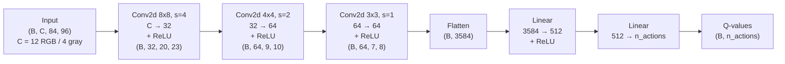
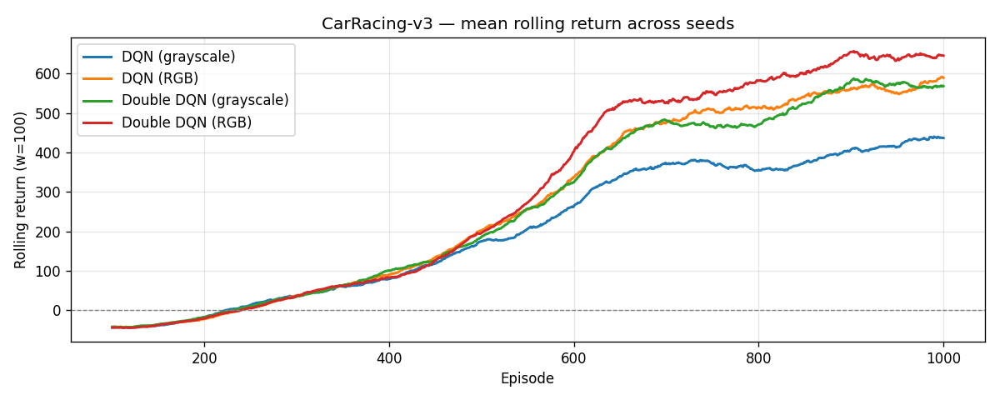
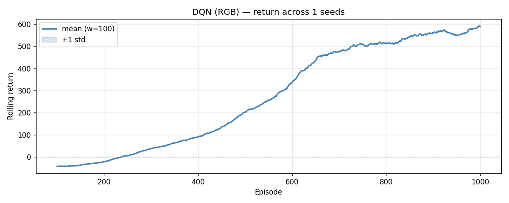
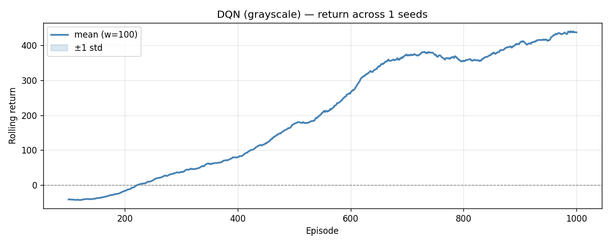
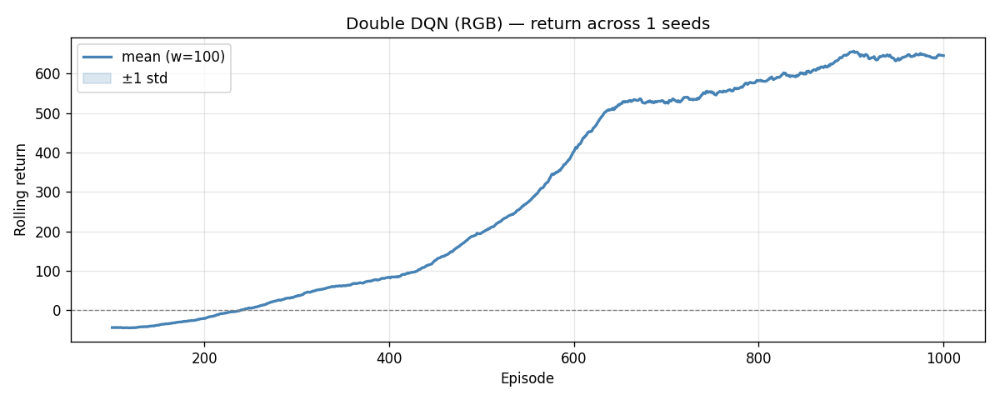
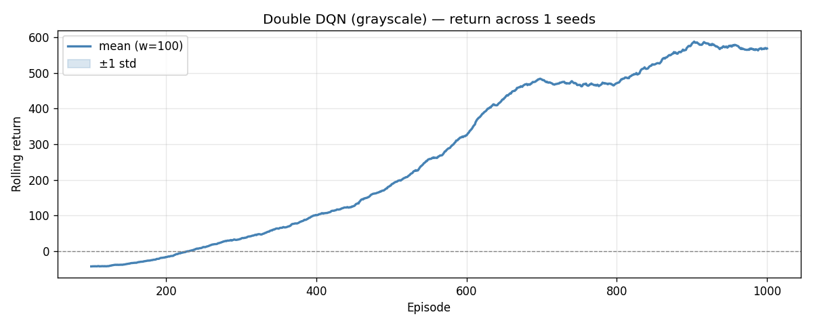
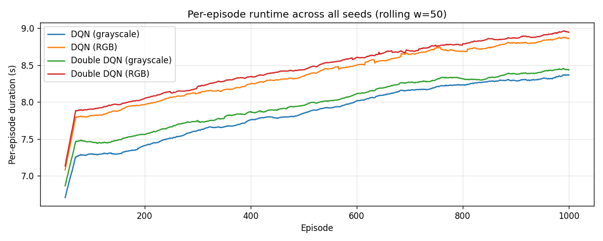
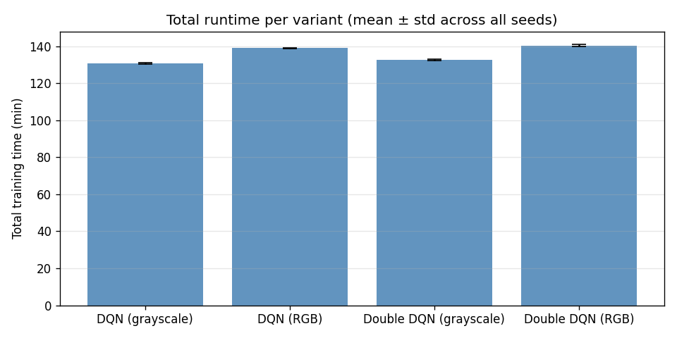

# Reinforcement Learning - Final Assignment

## Maybe it is better to train Race Cars with RGB colors?

Rutger de Groen - i6297772

## 1. Introduction

Carracing environments in AI were one of the first things that intrigued me about AI. "How the hell does this 2D car learn to drive this weird maze in several 100 generations?", i was baffled, did not understand this at all. Now 6 years later, following a course called Reinforcement Learning, I got the opportunity (Read: I was lazy for 6 years) to delve deeper into this matter. This final assignment implements a DQN algorithm to the carracing environment provided by Gymnasium (CITE) to teach a car drive a circuit.

## 2. Problem Statement or Research Statement

Ofcours I am not the first one trying to teach this car to drive. This environment is merely a toy example compared to what Tesla is doing with their cars. But anyways, I am here to learn about RL not about full driving autonomous cars in the real world. One of the first things I noticed about several implementation of DQN on the carracing environment from gymnasium, was the fact that all of them were trained after grayscaling the frames. I asked myself, "why not in rgb?". I guess the answer is quite trivial, the car does not neceserally have to learn colors to understand shapes and edges as long as there is some difference to the road and off-road parts. And secondly grayscale means learning less information, 1 channel instead of 3 color channels, so less computational complexity. But none of the online work (CITE) I found showed rgb results or talked about this difference fundamentally. So this final assignment I am going to figure out why people choose grayscaling over rgb, and if the "trivial" answer is so "trivial" after all!

To be a little bit more specific: "Is color really not that important for this type of game? and whatever the outcome is, why?"

## 3. Methodology

I used Torch (CITE) for the DQN's and Gymnasium for the environment. My goal is to check the difference between RGB and grayscale, so I created to preprocessing functions to handle color of frames. I used a standard DQN network as can here be seen:

On top of that I got inspired by this repo [DQN-Car-Racing-Repo-1](https://github.com/wiitt/DQN-Car-Racing), and also implemented Double-DQN. I know this does not really have to do any thing with measuring the difference between RGB and grayscale. But as I said in the beginning I am here to learn some cool things about RL, so why not throw some exploration in there! Double-DQN it is, so I tried this as well just to see what kind of effects it has on output results and mainly "why?".

To see wheter my implementation is somewhat correct, I matched the results using this repo: [DQN-Car-Racing-Repo-1](https://github.com/wiitt/DQN-Car-Racing). Note that I did not copy any code what so ever, even better, their implementation is completely Gymnasium based as where I used Torch and Gymnasium as a combination.

## 4. Experimental Setup

I ran 4 different networks, with each 3 different seeds for trustable outcomes and reproducibility. This means 12 different configurations. They are as followed:

- DQN/Double DQN \* RGB/Grayscale \* 3 different seeds.

Over all configurations, the network architecture and parameters stayed the same, they are as follows:



In config.py exists a parameter called DOUBLE_DQN, that enables the user to turn double DQN on or off.

Some other settings from config.py:

``` ~python
EPS_START     = 1.0
EPS_END       = 0.05
EPS_DECAY     = 150_000
TRAIN_START   = 5_000
TARGET_UPDATE = 1_000
SAVE_EVERY    = 10
MAX_EPISODES  = 1_000
GAMMA         = 0.99
LR            = 1e-4
BATCH_SIZE    = 32
BUFFER_SIZE   = 300_000
STACK_N       = 4
```

I deliberatly choose to run only 1000 episodes (250k steps), since this alone took around 1.5-2hrs. The whole sweep took me around 24 hours to run. But 1000 episodes were also just enough to show decent learning results and explain difference where needed.

Other than that most of the configuration parameters are inspired by online work, to match the results so I could purely focus on the RGB vs. Grayscaling matter.

For each configuration the output returns and Runtime, were logged, saved as csv, and plotted.

All configurations where ran on a Desktop PC, with 32 GB of RAM, a GTX1070 (please sponsor me, I would love to have better GPU), and AMD Ryzen 5 3600 6-core processor × 12.

## 5. Results

### 5.1 Mean rolling returns over all seeds across all 4 variants

<!-- markdownlint-disable MD033 -->

<!-- markdownlint-enable MD033 -->

The plot above shows the mean returns (over all 3 seeds) vs. episodes of all 4 variants. Double DQN with RGB clearly dominates all other strategies. DQN with RGB ending second, DQN with grayscale third and Double DQN with grayscale with a significant difference last.

### 5.1 Mean rolling returns over all seeds across all 4 variants seperate

<!-- markdownlint-disable MD033 -->
<table>
<tr>
<td></td>
<td></td>
</tr>
<tr>
<td></td>
<td></td>
</tr>
</table>
<!-- markdownlint-enable MD033 -->

The plots above show the mean rolling returns for each variant seperately. Here is shown that the RGB variants get results higher than 600 easily after 1000 episodes. On the other hand the Grayscaled variants struggle to get their mean returns higher than 600 after 1000 episodes. Another thing these plots show is that Double DQN with RGB shows the smallest variance compared to the other variants.

### 5.3 Runtime experiments

<!-- markdownlint-disable MD033 -->
<table>
<tr>
<td></td>
<td></td>
</tr>
</table>
<!-- markdownlint-enable MD033 -->

These plots show a clear difference in runtime between the RGB and Grayscale variants. RGB clearly takes longer than Grayscale. Total runtimes show that the variants with RGB take roughly 10-15 minutes longer than the grayscale variants. The per episode plot shows that with an overall increasing runtime per episode the difference does not change around 1.5 seconds.

## 5.5 Demo

- insert GIF

## 6. Discussion

- explain why resultls are like this. interpret them.
- 5.1/5.2 why does Double DQN perform bad on grayscaling but well on rgb?
- 5.1 why does rgb perform better over the same amount of episodes?
- 5.2 why does rgb have less variance?
- 5.3 explain why runtime is longer.

## 7. Conclusion

- i guess we could say it does not matter that much.
- more iumportantly if it is because of time, i would not change to grayscale, time is not that big of a deal
- my experience showed that RAM was more of an issue (does rgb have influence on this?)
- more over RGB seems to show better convergence overall, if it does not take that much more time, why not choose it if the returns are better within the same number of episodes?

### 7.1 What did I learn?

## 8. References

- [DQN-Car-Racing-Repo-1](https://github.com/wiitt/DQN-Car-Racing)
- [DQN-Car-Racing-Paper](https://arxiv.org/html/2410.22766v1#Ch1.S1) (showed rgb results but it was not on dqn but on resnet)
- [DQN-Car-Racing-Repo-2](https://github.com/andywu0913/OpenAI-GYM-CarRacing-DQN) (also stating that color does not matter that much for this game but not why?)

## Todo

- Clean methodology and experimental setup sections
- Write discussion 
- Write Conclusion
- Write What did I learn
- Add demo
- Record Video